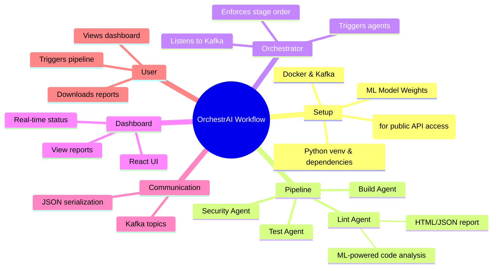
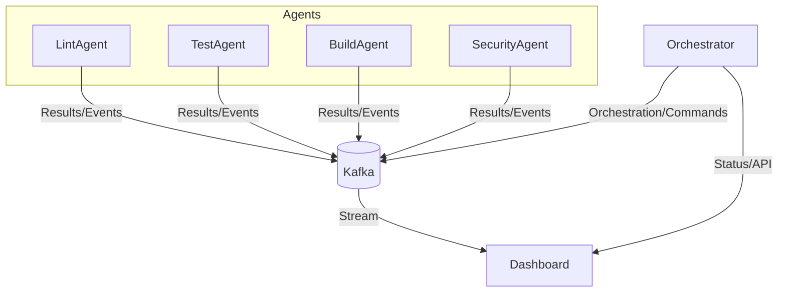
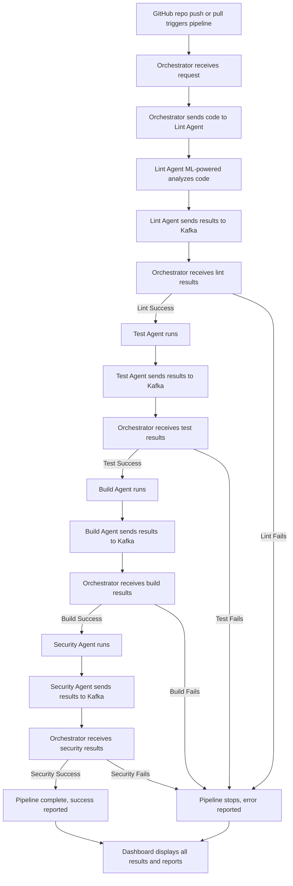

# OrchestrAI: Intelligent Multi-Agent DevOps Pipeline Orchestrator

---

## Overview

**OrchestrAI** is an advanced, event-driven CI/CD pipeline orchestrator that leverages a multi-agent architecture and state-of-the-art machine learning for intelligent, automated code quality, security, and deployment workflows. It features a fine-tuned CodeT5+ ML model for deep code analysis, strict sequential pipeline enforcement, and real-time communication via Kafka. A React-based dashboard provides live monitoring and insights.

---

Multi-Agent




## Key Features

- **ML-Powered Lint Agent**
  - Utilizes a fine-tuned CodeT5+ model (runs on GPU if available) for context-aware code review, bug detection, and actionable suggestions.
  - Generates detailed HTML reports and structured JSON results for each lint job.
- **Multi-Agent Pipeline**
  - Modular agents for linting, testing, building, and security, each running as independent services.
  - Strict sequential execution: each stage (lint → test → build → security) only runs if the previous one succeeds.
- **Event-Driven Orchestration**
  - All agent communication and orchestration handled asynchronously via Kafka topics.
  - Robust serialization: all results and context are sent as JSON.
- **Dashboard UI**
  - React + Tailwind CSS dashboard for real-time pipeline monitoring and visualization.
- **Scalable & Extensible**
  - Easily add new agents or extend existing ones.
  - ML agent is modular and can be further fine-tuned or swapped for other models.
- **GPU Acceleration**
  - ML lint agent automatically uses GPU (via PyTorch CUDA) for high performance.

---

## Architecture



---

## Workflow Mind Map



---

## Tech Stack

- **Python 3.10+** (FastAPI, Pydantic, Kafka-Python)
- **PyTorch, Transformers** (Hugging Face, CodeT5+ fine-tuned model)
- **Docker & Docker Compose** (for Kafka, Zookeeper, agent isolation)
- **React 18, Tailwind CSS** (dashboard UI)
- **Kafka** (event bus for agent communication)
- **HTML, JSON** (reporting and result serialization)
- **ngrok** (for public API tunneling, optional)

---

## How to Use: Step-by-Step Guide

### 1. Prerequisites
- **Python 3.10+**
- **Node.js** (for dashboard)
- **Docker & Docker Compose**
- **NVIDIA GPU + CUDA** (optional, for ML acceleration)
- **ngrok** (optional, for public API access)

### 2. Clone & Environment Setup
```bash
git clone https://github.com/adhi982/Orchestr_AI.git
cd Orchestr_AI
python -m venv venv
source venv/bin/activate  # or .\venv\Scripts\activate on Windows
pip install -r requirements.txt
```

### 3. ML Model Setup
```bash
cd agents/lint_agent/ml_model
pip install -r requirements.txt
# Ensure model weights are present in checkpoints/codet5p-finetuned/
```

### 4. Start Kafka & Zookeeper
```bash
docker-compose up -d
```

### 5. (Optional) Start ngrok for Public API Access
- [Download ngrok](https://ngrok.com/download)
- Start a tunnel to your orchestrator API (default FastAPI port is 8000):
```bash
ngrok http 8000
```
- Copy the public URL from ngrok output (e.g., `https://xxxx.ngrok.io`)

### 6. Run Orchestrator & Agents
Open separate terminals for each process:
```bash
# Orchestrator (API server)
uvicorn orchestrator.main:app --reload

# Lint Agent (ML-powered)
python agents/lint_agent/main.py

# Test Agent
python agents/test_agent/main.py

# Build Agent
python agents/build_agent/main.py

# Security Agent
python agents/security_agent/main.py
```

### 7. Start the Dashboard
```bash
cd dashboard
npm install
npm start
```
- Access the dashboard at [http://localhost:3000](http://localhost:3000)

### 8. Triggering a Pipeline
- Use the dashboard UI to trigger a new pipeline run (if supported)
- Or, send a POST request to the orchestrator API (see API docs at `/docs` when FastAPI is running)

### 9. Viewing Results
- Monitor real-time status and logs in the dashboard
- Download/view HTML and JSON reports for each stage

---

## GitHub Integration: Triggering Pipelines via Webhook

You can automate pipeline runs by connecting your GitHub repository to OrchestrAI using a webhook. This allows every push or pull request to trigger the orchestrator automatically.

### Step 1: Get Your Public Orchestrator URL
- If running locally, use ngrok to expose your orchestrator's FastAPI endpoint:
  ```bash
  ngrok http 8000
  ```
- Copy the HTTPS URL provided by ngrok (e.g., `https://xxxx.ngrok.io`).

### Step 2: Add a Webhook to Your GitHub Repository
1. Go to your repository on GitHub.
2. Click on **Settings** > **Webhooks** > **Add webhook**.
3. In the **Payload URL** field, enter:
   ```
   https://xxxx.ngrok.io/webhook
   ```
   (Replace with your actual ngrok/public URL and the correct endpoint as implemented in your orchestrator.)
4. Set **Content type** to `application/json`.
5. Select **Just the push event** or add **pull_request** if you want both.
6. (Optional) Add a secret for security and configure your orchestrator to verify it.
7. Click **Add webhook**.

### Step 3: Orchestrator Webhook Endpoint
- Ensure your orchestrator exposes a `/webhook` POST endpoint to receive GitHub events.
- The endpoint should parse the payload and trigger the pipeline accordingly.
- Example minimal FastAPI endpoint:
  ```python
  from fastapi import FastAPI, Request
  app = FastAPI()

  @app.post("/webhook")
  async def github_webhook(request: Request):
      payload = await request.json()
      # Validate and trigger pipeline here
      return {"status": "received"}
  ```
- For security, validate the GitHub webhook secret if set.

### Step 4: Test the Integration
- Push a commit or open a pull request in your GitHub repo.
- The orchestrator should receive the webhook and start the pipeline automatically.
- Monitor the dashboard for the new pipeline run.

### Example Payload
GitHub sends a JSON payload like:
```json
{
  "ref": "refs/heads/main",
  "before": "...",
  "after": "...",
  "repository": { "full_name": "youruser/yourrepo" },
  "pusher": { "name": "youruser" },
  ...
}
```

### Notes
- Update the workflow diagram to show the GitHub webhook as the first trigger step.
- Secure your webhook endpoint (e.g., with a secret or IP allowlist).
- You can extend the webhook handler to support custom logic, filtering, or branch-specific triggers.

---

## Troubleshooting & Tips
- **ngrok not found:** Download and add ngrok to your PATH.
- **Kafka/Zookeeper errors:** Ensure Docker is running and ports 2181, 9092 are free.
- **GPU not detected:** Check CUDA installation and PyTorch version. The lint agent will print `loaded on cuda` if GPU is used.
- **Dashboard not loading:** Ensure Node.js is installed and all dependencies are installed with `npm install`.
- **Agent connection issues:** Check Kafka health and that all agents are running.
- **Model weights missing:** Download or copy the fine-tuned model files to `agents/lint_agent/ml_model/checkpoints/codet5p-finetuned/`.

---

## Pipeline Flow

1. **Lint Agent**: Analyzes code using the ML model, generates reports, and sends results to Kafka.
2. **Orchestrator**: Listens for agent results, enforces strict stage dependencies, and triggers the next agent only on success.
3. **Test, Build, Security Agents**: Run sequentially, each reporting results/events via Kafka.
4. **Dashboard**: Visualizes pipeline status, agent results, and reports in real time.

---

## Output & Reporting

- **HTML Reports**: Human-friendly, detailed code analysis for each lint job.
- **JSON Results**: Machine-readable, structured output for orchestrator and dashboard.
- **Real-Time Dashboard**: Live pipeline status, agent logs, and result visualization.

---

## Example Output

```json
{
  "pipeline_id": "...",
  "stage": "lint",
  "success": true,
  "results": {
    "issues": [
      {
        "file_path": "app.py",
        "line_number": 42,
        "issue_type": "bug",
        "severity": "major",
        "title": "Possible off-by-one error",
        "suggested_fix": "Check loop bounds.",
        "explanation": "ML model detected a likely off-by-one error in this loop."
      }
    ],
    "stats": {...},
    "insights": {...},
    "report_path": ".../intelligent_lint_report.html"
  }
}
```

---

## Development Notes

- All agent results are serialized to JSON for robust, language-agnostic communication.
- The ML lint agent is modular and can be further fine-tuned or extended.
- The orchestrator enforces strict stage dependencies for reliable CI/CD.

---

## Acknowledgements

- Built with Hugging Face Transformers, PyTorch, FastAPI, Kafka, Docker, and React.
- Fine-tuned CodeT5+ model for advanced code analysis and review.

---

For more details, see the HTML report generated for each lint job or contact the project maintainer.

